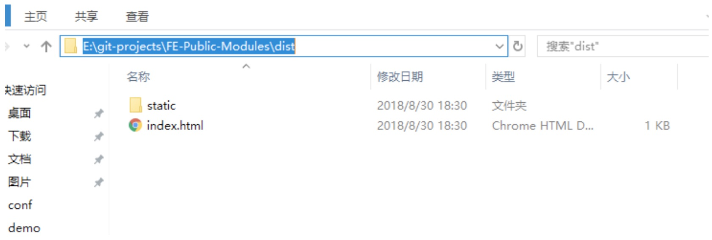
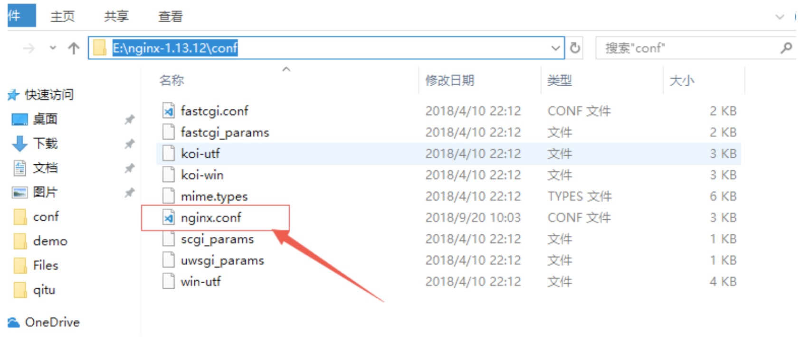
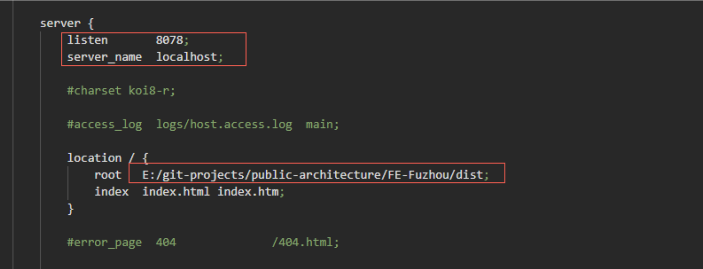
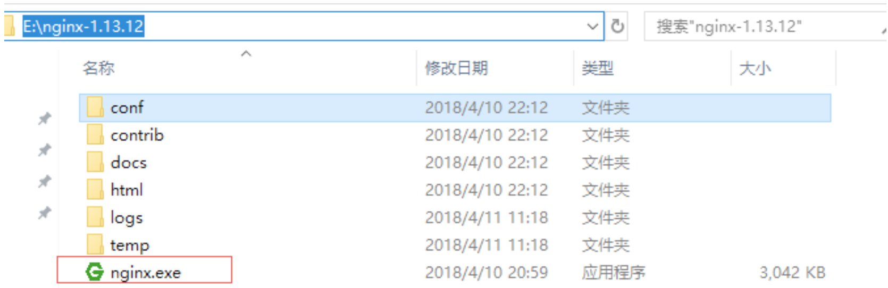
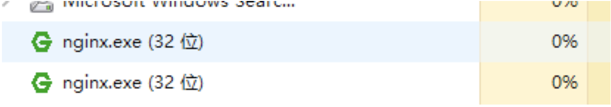

#前端部署说明  
1.  前端存放打包dist文件目录：如图  

2.  配置nginx：如图  
  
修改root配置为图1 所示  
下图 listen为监听端口  
server_name 为访问域名（一般为本机IP地址） 
 

3.  完成以上部分后，启动nginx.exe程序
 
启动完成后 查看任务管理器 确认是否启动成功：启动成功后 任务管理器里面会出现
如下图所示：
 

4、进入浏览器页面，输入配置好的server_name 和监听的端口listen