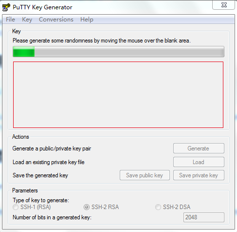
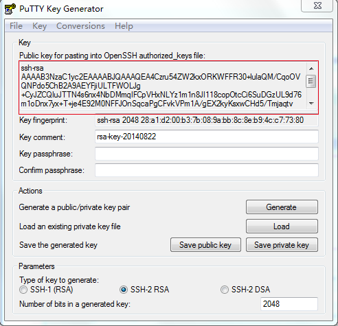
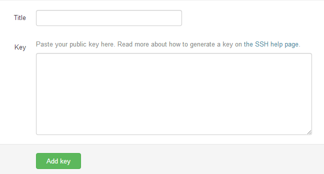
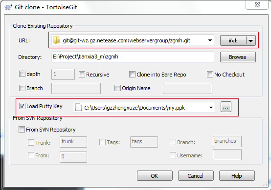
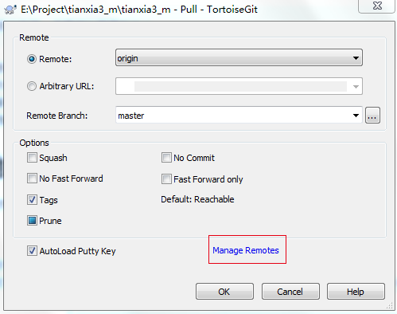
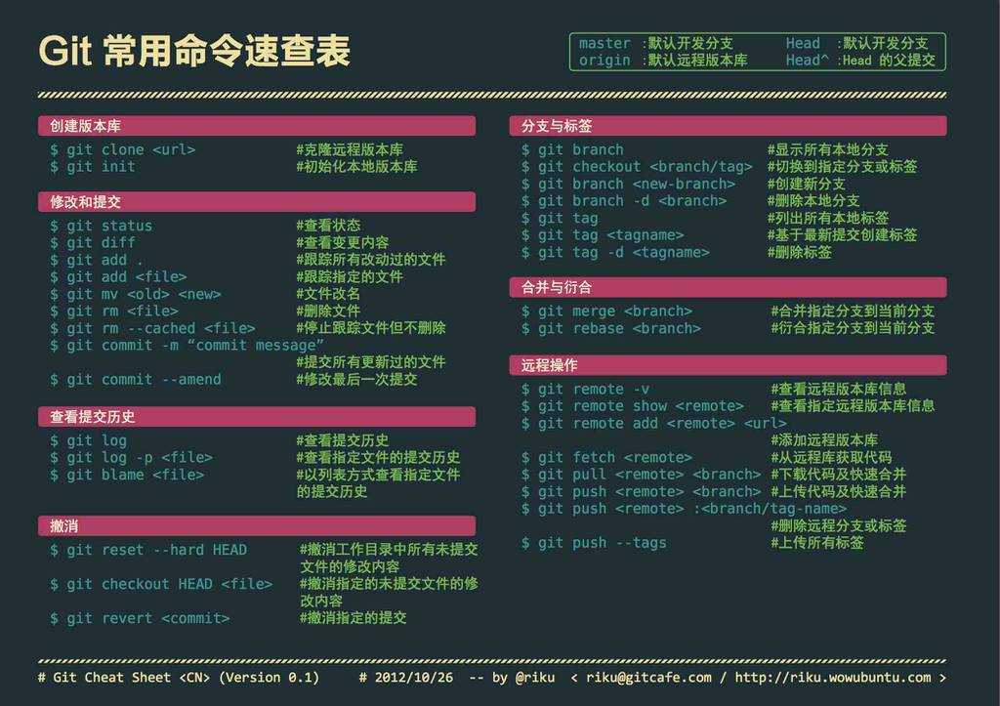

#Git服务使用说明  
##使用项目   
> 以下情况的项目，一律必须接入到git中   

1. 新项目  
2. 旧项目需要维护  

##使用之前需要安装  
>  以下软件，按顺序安装，而且所有项目都选择默认选项  

1. Git for Windows，下载地址：http://msysgit.github.io/，下载慢的话，找我要安装包  
2. TortoiseGit，下载地址：http://www.onlinedown.net/soft/101592.htm  

##设置SSH Key  

1. 在开始菜单中，找到TortoiseGit文件夹，找到Puttygen程序，打开它，点击按钮Generate，鼠标需要在红框区域内，不停的移动，否则上面的进度条是不会动的，如下图：   

2. 生成完后，复制红框内的所有文本，如下图：   

3. 之后点击Save priveate key按钮，找个地方保存你的私有key，名字随便起，例如：my.ppk

4. 登陆http://10.168.4.20:8099/，账号密码是你的git账号  

5. 点击网页的右上角的空白头像，然后再点击Edit profile setting，选择SSH Key的Tab，点Add SSH Key，如下图： 

6. 在Title中随便输入名称（英文），在Key中粘贴刚才第2步中的文本，然后Add Key  

##新建项目  
> 项目的新建、查看都在管理系统上

1. 登陆http://10.168.4.20:8099/
2. 点击Add New Project，新建项目
3. 填写项目名称、描述那些，名称只能是英文+数字+符号
4. 把最后一个勾，勾选上

##本地项目代码checkout  
1. 在管理系统中，进入你的项目，查看右上角，复制地址，如图：
2. 在本地新建一个文件夹，名字跟你项目名字一样（不能中文哦）
3. 在文件夹上右键，选择Git Clone，URL中输入刚才复制地址，Load Putty Key选择之前保存的my.ppk文件，打上勾，如图所示：
  
4. 其它选择不填也不勾，确定后，就能拉取项目下来（刚新建应该是空的）  

##更新线上最新代码到本地  

1. 在项目文件夹中，右键，选择TortoiseGit，选择Pull
2. 点击红框中的Manage Romates，如图： 
   
3. 在右侧的URL中输入项目的git地址，然后Remote中输入你项目的名称，点击Add New/Save
4. 返回第2步中，下拉Remote，选择刚才的项目名
5. Remote Branch中，输入master，点击ok就可以了
6. 以上输入的东西，输入过一次，以后都不用输入的了 

##添加项目成员  
> 不添加项目成员，就只能是项目的创建者能提交代码，其他人只能拉取代码  

1. 在git项目管理系统中，点击需要添加成员的项目
2. 点击Settings
3. 点击左侧的Members
4. 点击右上角的New roject member
5. 在输入框中，搜索到你的成员
6. Project Access选择Developer  

##提交代码  
>  提交代码之前，必须先更新代码

1. 在项目文件夹中，右键，选择Git Commit->master
2. 上面填写修改的日志，必须填，下面选择这次要提交的文件
提交完后，需要点击左下角的Push按钮，如图： Alt text
Local选择master，Remote也选择master，还有一个Remote选择之前的项目名
点击ok，提交服务器，这样代码的修改，就能在Git管理系统中看到了
备注：虽然git的一开始使用比较麻烦，但只要弄好了，之后就能简单很多了.

##Git常用命令速查表	
