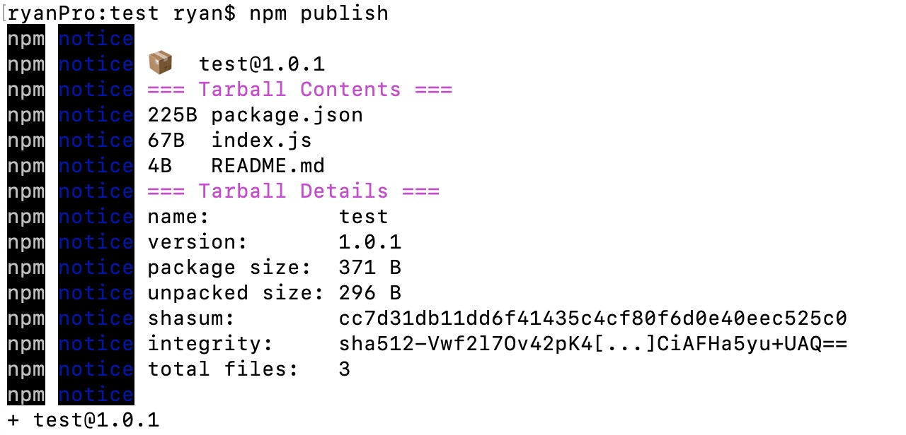

#道枢组件库操作使用说明
##组件库地址  
```
http://10.168.4.143:4873
```
##配置npm  
```
npm set registry http://10.168.4.143:4873
```
##登陆注册npm账号  
```
npm adduser --registry http://10.168.4.143:4873
```
填写信息，注册账号。如果已经有账号，直接运行npm login即可。  
注册信息如：

```
Username: test
Password: test
Email: (this IS public) youname@company.com
```
##验证账户是否登陆成功  
```
$ npm who am i
```
将会显示该用户名信息	  
##发布npm包
进入该包目录下，运行
```
$ npm publish  
```
如图:
  

##版本更新
```
npm version <update_type> -m "<message>"
```
其中update_type 有三种：  

patch增加一位补丁号（比如 1.1.1 -> 1.1.2）  

minor增加一位小版本号（比如 1.1.1 -> 1.2.0）  

major增加一位大版本号（比如 1.1.1 -> 2.0.0）  

比如：  
```
npm version patch -m "Version %s - v1.0.2"
```

最后提交更新的版本：  
```
npm publish
```
###舍弃某个版本的模块  
```
npm deprecate my-thing@"< 1.0.2" "critical bug fixed in v1.0.2"
```
###撤销自己发布的版本。这只是一个测试的包，最好当然还是撤销下来  


>  //删除要用force强制删除。超过24小时就不能删除了。自己把握好时间。  
```
npm --force unpublish mti_npm
```

>  强烈推荐使用nrm来管理自己的代理。


##安装nrm:  
全局安装nrm可以快速修改,切换,增加npm镜像地址。  
```
$ npm install -g nrm # 安装nrm
$ nrm add XXXXX http://XXXXXX:4873 # 添加本地的npm镜像地址
$ nrm use XXXX # 使用本址的镜像地址
nrm的其他命令：
$ nrm --help  # 查看nrm命令帮助
$ nrm list # 列出可用的 npm 镜像地址
$ nrm use taobao # 使用`淘宝npm`镜像地址
```
安装包   
安装完成.之后你通过npm install 安装的包,sinopia都会帮你缓存到本地了.试一下吧。  
```
mkdir test && cd test
npm install lodash # sinopia发现本地没有 lodash包,就会从 taobao镜像下载
rm -rf node-modules # 删除目录
npm insatll lodash # 第二次安装就会从缓存下载了,速度很快
```
创建用户与发布包  
创建新用户  

1.确保自己已经切换到配置的代理  

```
  nrm ls  

  npm ---- https://registry.npmjs.org/  
  cnpm --- http://r.cnpmjs.org/  
  taobao - http://registry.npm.taobao.org/  
  nj ----- https://registry.nodejitsu.com/  
  rednpm - http://registry.mirror.cqupt.edu.cn  
  npmMirror  https://skimdb.npmjs.com/registry  
* mtinpm  http://10.168.4.143:4873/
```
2.运行npm adduser,填写信息，注册账号。如果已经有账号，直接运行npm login即可。  
```
  npm adduser --registry http://10.168.4.143:4873/  
  Username: test  
  Password:  
 ```
3.运行$ npm publish发布新包。